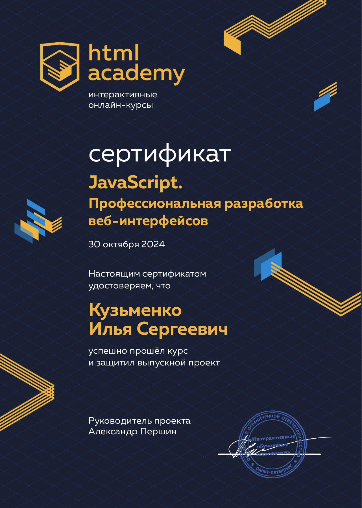
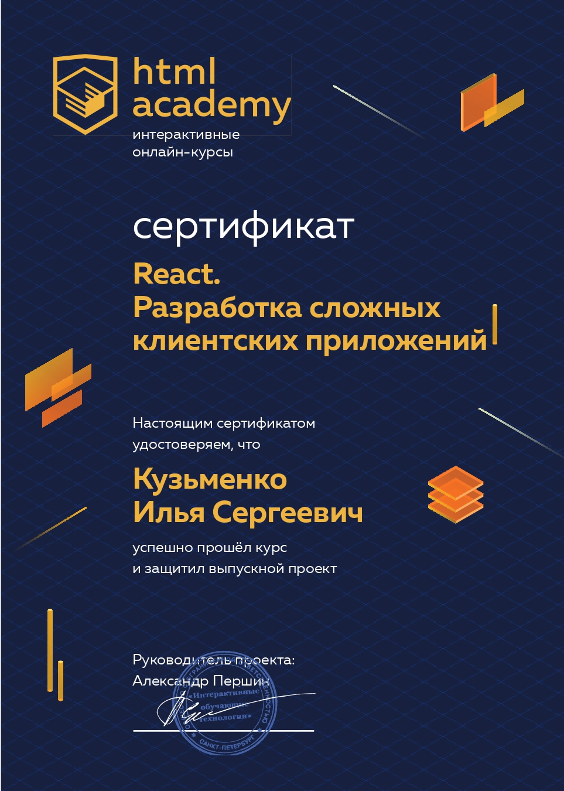

<h2 align="center">Меня зовут Илья Кузьменко, я JavaScript-разработчик

### 👩‍💻 Обо мне:

Мне нравится решать задачи: разрабатывать сайты, веб-приложения.Вдохновляют ощущения от выполненых задач.

Меня захватывает процесс разработки и возможность создавать удобные и полезные продукты.

Учился в HTML Academy по профессии [JavaScript-разработчик](https://htmlacademy.ru/). Проходил стажировку в компании [Лига А](https://ligaa.agency/). Ежедневно практикуюсь в программировании, изучаю алгоритмы и фреймворки (React).

Открыт к предложениям на позицию JavaScript-разработчика, frontend-разработчика. Если у вас есть вакансия, которая соответствует моим навыкам и опыту — буду рад сотрудничеству 🙌

🎯 **Мои цели**:

- Писать чистый и поддерживаемый код;
- Работать в дружной команде профессионалов;
- Участвовать в интересных и значимых проектах;
- Вносить вклад в успех компании.

📫 **Cвязаться со мной**:

, 

---

### 🛠 Языки и Технологии:

### 🎨 Графические редакторы:

---

### 👨‍🎓 Образование:

|  | 

---
